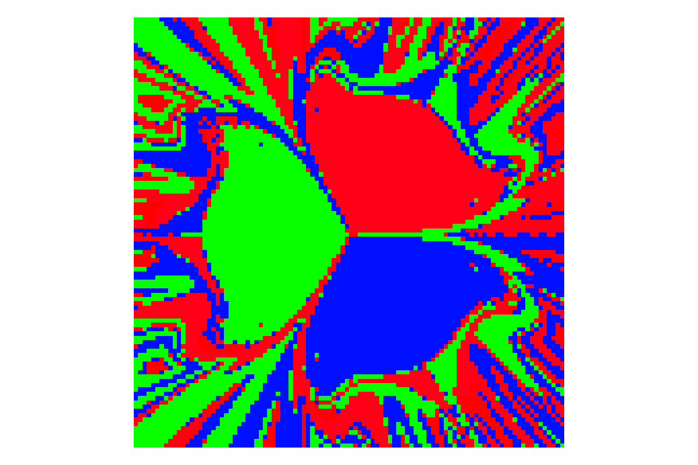

### Here we showcase how an intractable simple system can be integrated over itself   to reveal highly symmetric ordering.

#### The idea was adopted from this video: https://youtu.be/C5Jkgvw-Z6E by Hiro Shimoyama

#### This Python interpretation has many adjustable and explorable possibilites.
