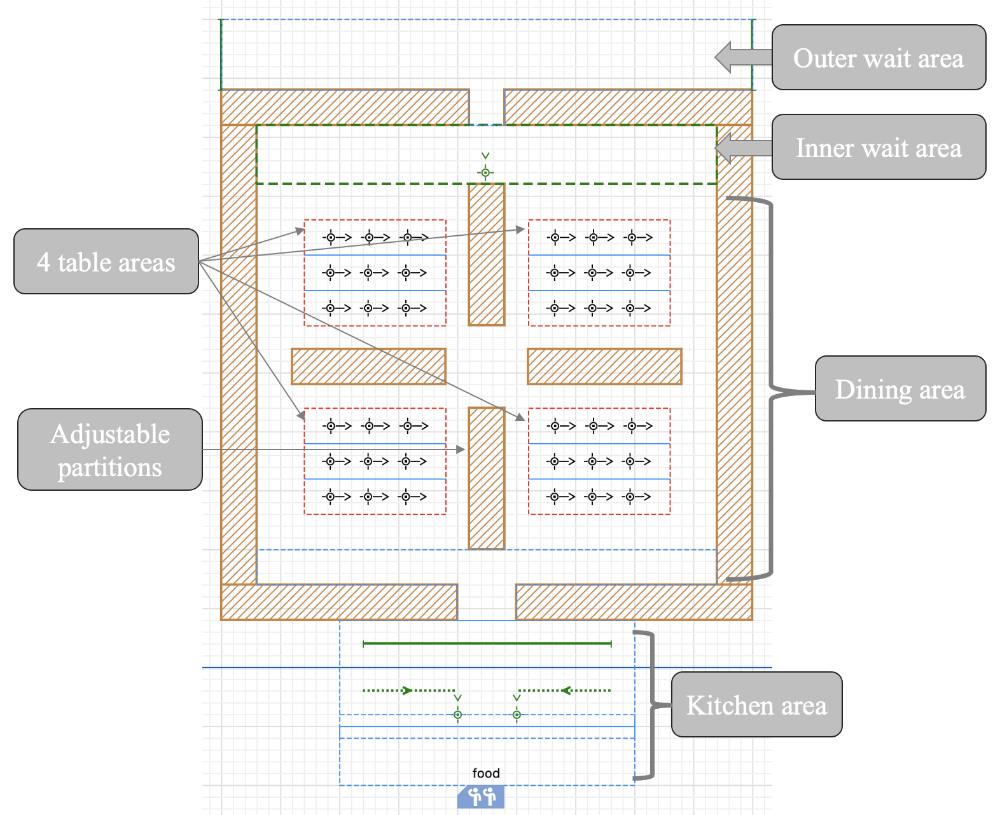
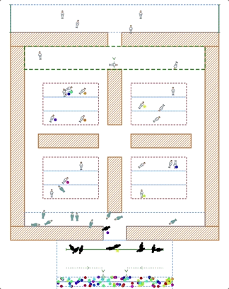
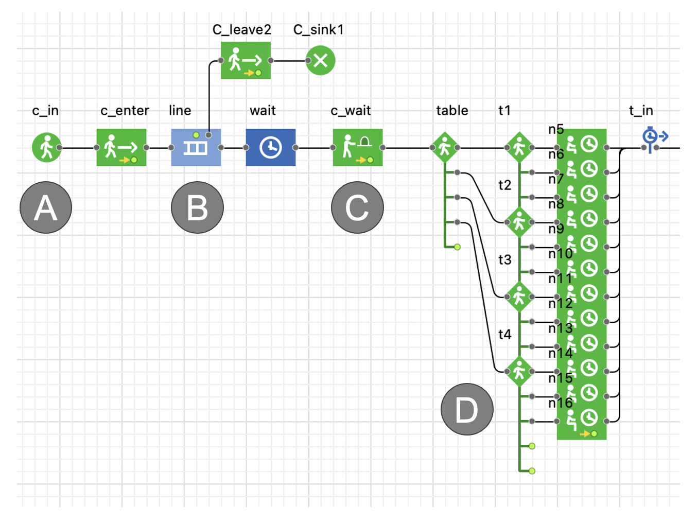
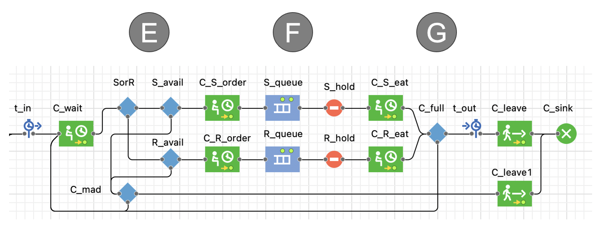
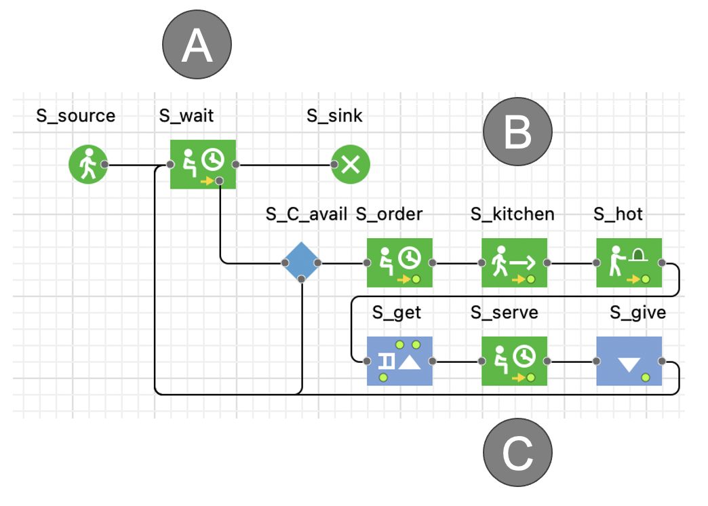
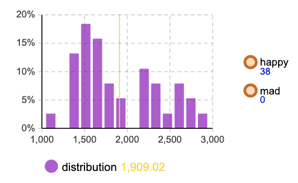
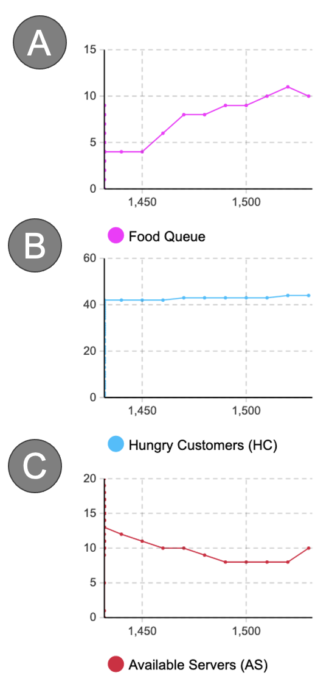

# Sloppy Joe's

This simulation exhibits a minimal simplistic design for testing purposes related to a large sit-down style restaurant.

## Introduction

The goal here is to examine the differences between robot and human servers.
This is done by making agents with slight variations.
Here we make the robots slightly slower than the human servers.
Of course this means they will not preform as well in terms of serving as many customers and reducing wait times, but it is a fair approximation to make, and allows us to examine how they interact with human servers regardless. For example, it is entirely possibly that having many fast moving agents would cause more disruptions -- like the internal friction of a hot gas. And that having some fast and some slow actually provides a more efficient dynamic. Therefore, despite some of the obvious conclusions involving faster agents being able to serve more guests (which is true across all our restaurants), we nevertheless are interested in examining the robot-server relationship admid various environments and parameterizations.

The basic layout of this restaurant is shown below.

One can imagine having the option to close or open the middle cross to enable a more or less exclusive experience, and so we can explore how this change in layout affects the overall dynamic.

An example animation of runtime simulation is shown below.

## Logic

Using AnyLogic software, we're able to model all the relevant dynamics with flow-chart style connections. The basic elements are agents, movements, waiting delays, random choices, queues, and function calls.

### Customer Logic

Below we see an example logic flow of customers.

A) 
- Customers enter the scene and join the outer queue.
  
B)
- This simulates the common situation where the restaurant might already be well-occupied.
- Notice that they can leave the queue if they have been waiting too long.
  
C)
- Once inside, they meet with the hostess, who can only interact with one agent at a time.
- This means that the customers sometimes have to wait even after they enter.
  
D)
- Now the customer is free to pick a table.
- These seeming complex connections are merely nested random choices.

Now that our customers have chosen a seat, we can model the logic of the dining experience.

E)
- The customers wait of a minute and decide on S (human server) or R (robot server). These probabilities are up to the simulatee.
- Once they have chosen, they must wait for an available server.
- If none are available, they ask themselves whether or not they are mad.
- This is controlled by a patience parameter, which is reduced everytime they ask for a server, yet none are available. After this value reaches 0, they are officially mad and will leave the resaurant.
  
F)
- Upon succesfully calling a server, they free them from their idle state, and are sent over to the customer's location.
- Now they order, after which the server returns to the kitchen and they enter a 'food queue'. This ensures that those who order first, recieve their food first -- which may not be entirely realistic, yet the food queue allows us to track how many customers are waiting on food as one of our key metrics.
  
G)
- Once the server has obtained their food, they release the customer from a hold, and allow them to eat.
- After they eat, they decide based on their hunger level whether or not they want to order again. This hunger level is another parameter from 1-3, meaning each customer will eat 1 to 3 means within a random uniform distribution.
- After this cycle completes, assuming they don't get mad, they simply leave happy.

Therefore, we track happy and mad customers. Note as well that there are timing blocks before and after this logic sequence, allowing us to track how long each customer spends in the restaurant -- calculated from the moment they sit down, to the moment they stand up.

### Server Logic

This logic applies to both human and robot servers for sake of simplicity. Certainly one can add extra duities for humans and robot servers alike, but with this given set-up we have a nice foundation for modeling the basic dynamics we're interested.

A)
- The servers wait at their designated location, until called upon. Althoguh it appears they can leave, in the given implementation, they cannot, and our obliged to work the full hour of simulation run-time.
- Once a customer calls them, they break free of waiting, and check if indeed a customer is available to be served (this avoids possible NULL exceptions of high-frequency events).
  
B)
- The server goes to the customer, collects their order, returns to the kitchen, and waits for a service queue.
- The kitchen service queue merely simulates the server waiting for the kitchen to provide the order.
  
C)
- Once recieved, the servers bring the order to the customer.
- Finally, they return to their designated waiting location, and remain idle until another customer demands their attention.

One drawback here is that customers do not necessarily recieve the same server for their orders. However, this is arguably a more efficient design (although less friendly), because any server available to serve will do so.

## Evaluation

### Metrics

As noted, time is kept track of for how long customers spend inside the restaurant, as exemplified below by a snap-shot of a running histogram.

The units here are seconds, and so the mean here translates to ~32 minutes, which is somewhat brief for a full sit-down experience, yet we were more interested in modeling as many guests as possible, within an hour, rather than providing a true-to-life simulation.

Additionally, we keep track of 3 dynamics arrays:

A)
- The food queue tracks how many customers are waiting on their food.
- They enter the queue after placing an order, and leave it after recieving the order.
  
B)
- Hungry customers tracks how many customers remain unsatisfied.
- They enter the simulation with a certain hunger level, as explained previously.
- After they eat, their hunger drops, and only after this reaches zero are they removed from the HC queue.
- This allows us to track the total number of customers not leaving the restaurant, and is a broader set than those simply waiting on their food.
  
C)
- Available servers is just that, how many servers are available.
- They begin available, and are unavailable when serving a customer.
- This could be because they are taking the order, moving, or waiting on the kitchen.

### Results

Results for the two layouts, human robot ratios, and arrival rate times can be seen in my previous assignment submission -- note however that in that assignment, times were boosted 60x real-time, in order to maximize the hour-long simulation cap, yet here simulation time = real time.

To summarize, it was found that each layout has an optimal number of arrival rates for a given number of servers -- as should be expected. This optimal state was found to be highly sensitive to robot human ratios, despite their slight speed differences, in favor of maximizing humans and minimizing robots (note as well that only one robot can enter each table node at a time, simulating a saftey procaution, such that they do not interfere with eachother).

Most surprisingly, in this updated model, it was found that human-robot combinations sometimes outperformed pure humans on our closed layout -- please see the main results for these details and more.

----------------------

