### AnyLogic

#### Simulated Resturant -- The Efficacy of Robotic Servers

Our resturant simulates a typical experience:
* Customers arrive in the area
* They wait in an external queue
* Then they enter and are serviced by a hostess
* They pick a table
* A server then comes to take their order
* The server returns to the back where the order is placed
* They then bring food or whatever out to the customer
* After eating, the customer decides if they want more
* This repeats utill they are satisfied
* Then they leave

When customers enter they do so with a certain 'hunger level', which ranges from 1-3, indicating how many meals they get, and essentially how long they stay. While waiting for their food, they are part of the Hungry Customers (HC) list, and after they have spoken to an Available Server (AS), they are entered into the 'Food Queue' (FQ). This is designed such that the first customer that sits gets server first, as per the typical FIFO ordering. The FQ is tracked over time, and has a limit of 30 customers -- however, the upper limit is actually the number of AS which starts out at 20. This is because if no server is available, they do not enter the FQ, they instead continue to wait, and their 'patience level' drops. Their patience ranges from 5-10 and once it hits zero they will leave mad, rather than happy. If customers are eating, or if they have left, they are removed from the HC list.

Total customers served during the simulation is the number of happy + the number of mad. Ideally we are trying to minimize the angry customers, but these parameters are for testing purposes only, and are only intuitively estimated. What we're really interested in is the dynamics. Given how the customers and servers interact with eachother and the environment, many dynamics can arise, and we are interested in how these dynamics behave on a statistical level. For example, too many customers per server will bottle-neck the resturant flow. The parameters are adjusted therefore to be reasonably accurate yes, but as well such they control the flow of the resturant. What we're looking for in the dynamics is a steady-state, which should occur with reasonable flexibility after some intitial period of time. The steady state can then be optimized, via the geometry of the environment, the internal parameterization, or the logic of the interactions.

#### A) & B)
In an effort to understand this optimization, we examine the resturant's dynamical flow under 3 main adjustments:

* How the geometry of the resturant is designed
* * *closed* or *open*
* The customer arival rate
* * 100/h, 200/h, or exp(0.06)/h
* What kind of servers we are simulating
* * robots, servers (humans), or both

Therefore we test 2 geometries x 3 arrival rates x 3 server options, which makes for 18 possibly interesting combinations.

First, we look at 100 customers per hour*

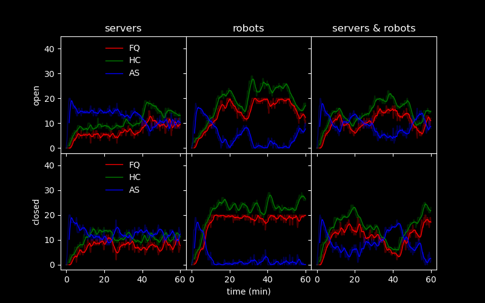

Next we look at 200 customers per hour

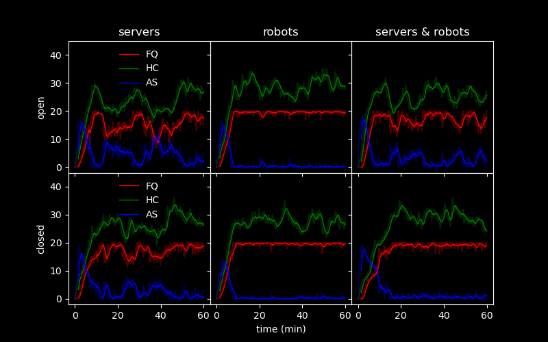

Finally we look at exp(0.06) customers per hour

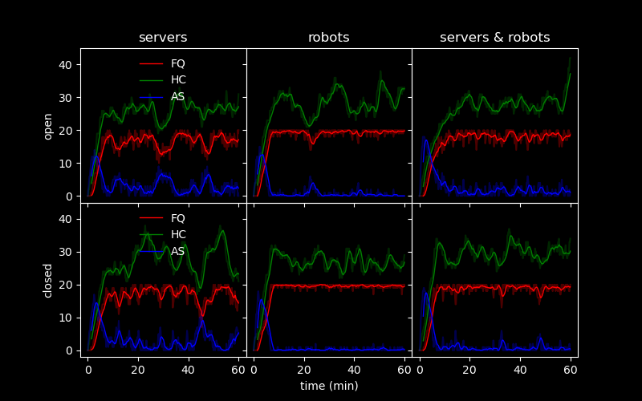

Three obvious trends emerge. 

Most notebaly, open geometries generally do better than closed -- this is because servers and robots have extra space to move around. 

Additionally, servers in general out-preform the robots, with them working together as a compromise in preformance. This is because of the design: the robots are made slightly slower than the human servers, and, importantly, only one of them can enter each of the 4 table nodes at a time (this is to simulate the real world concern about too many robots getting in customer's, servers, and eachother's way). 

Finally, 'steady' states are seen in addition to 'oscillatory' states. There is the *good* steady state, where all values hover around a mean -- see servers and robots in the first plot. *Bad* steady states are when the FQ remains around its 20 server limit, and the servers remain mostly unavailable. Oscillatory states are also seen, and are most interesting. In general, both the FQ and the HC values run opposite to AS values, due to the underlying logic, and it is this attraction-repulsion dynamic which leads to the oscillations -- another cause could be the inter-arrival time of the final test (exp(0.06)/h). 

What we desire is for the HC list to not rise, because that is the most direct evidence for the servers failing to keep up with demand. We see this happening most often in closed, robot situations, but these are not necessarily failure cases, only the least efficient. 

To get a better grip, we show direct histograms of customer's over-all wait time*, along with the tally of happy and mad customers. They are ordered just like the plots above, and labeled 1,2,3, for the arrival times, S, R, RS for server, robot, robot and server, and O, C, for open and closed geometries.

<table>
  <tr>
    <td>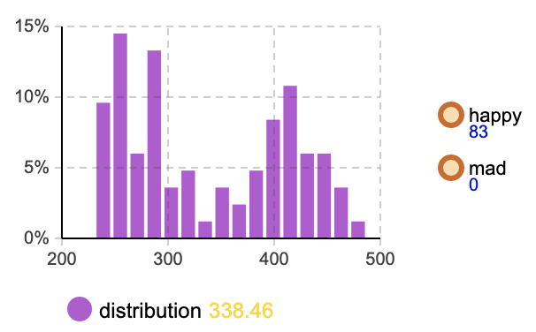 1_S_O</td>
    <td>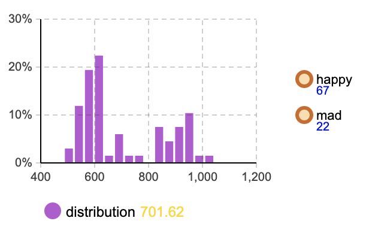 1_R_O</td>
    <td>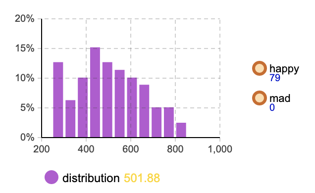 1_RS_O</td>
  </tr>
  <tr>
    <td>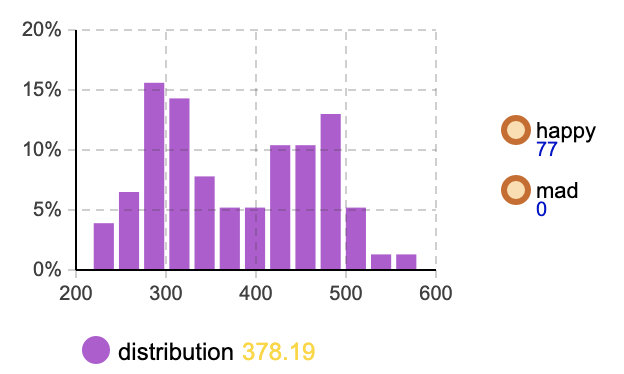 1_S_C</td>
    <td>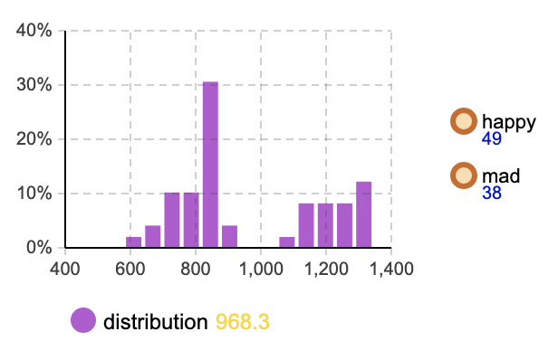 1_R_C</td>
    <td>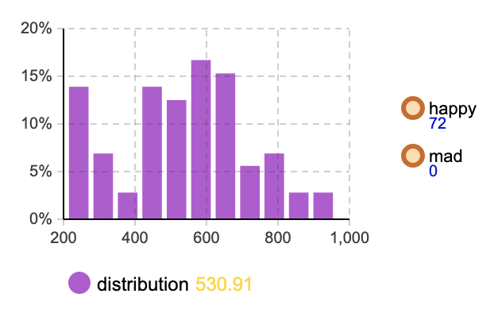 1_RS_C</td>
  </tr>
  <tr>
    <td>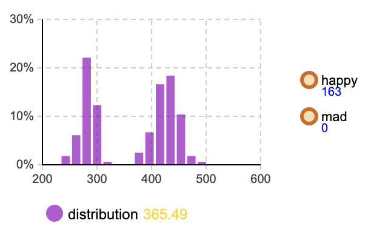 2_S_O</td>
    <td>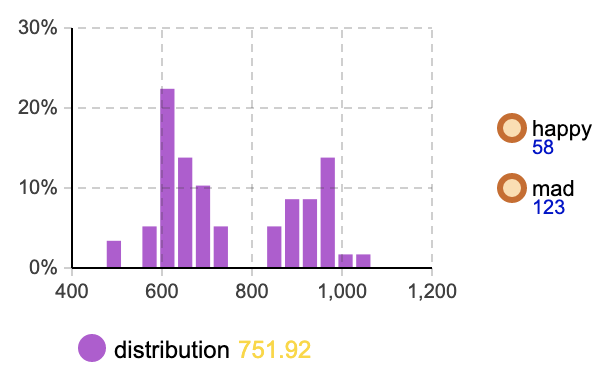 2_R_O</td>
    <td>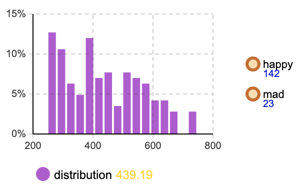 2_RS_O</td>
  </tr>
  <tr>
    <td>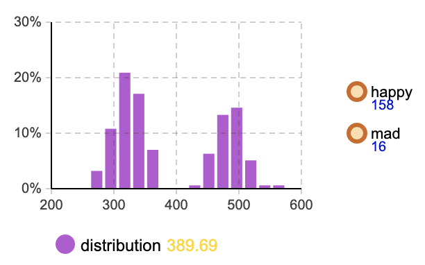 2_S_C</td>
    <td>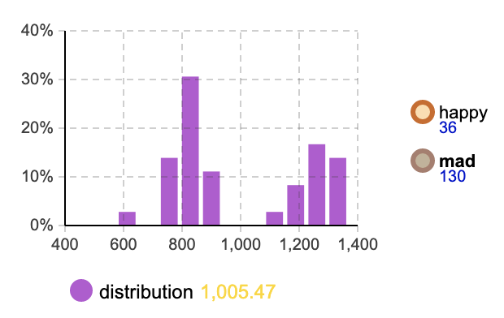 2_R_C</td>
    <td>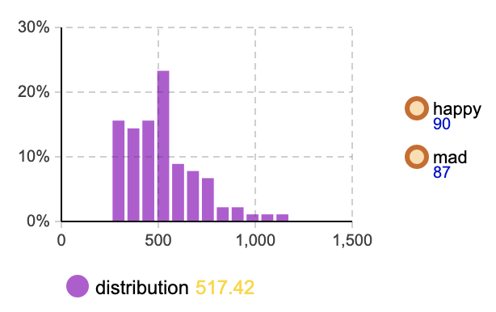 2_RS_C</td>
  </tr>
  <tr>
    <td>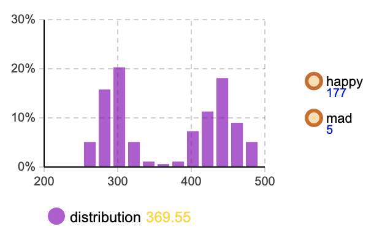 3_S_O</td>
    <td>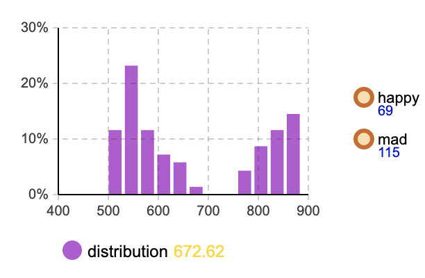 3_R_O</td>
    <td>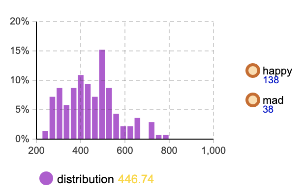 3_RS_O</td>
  </tr>
  <tr>
    <td>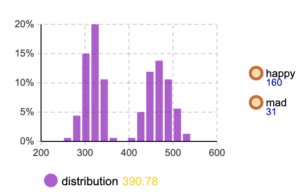 3_S_C</td>
    <td>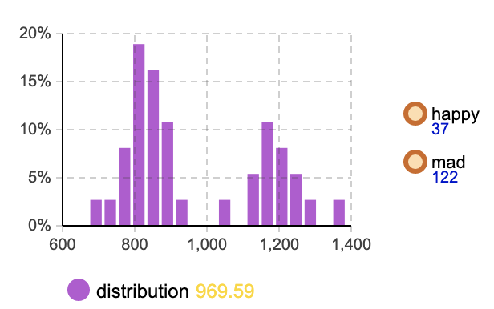 3_R_C</td>
    <td>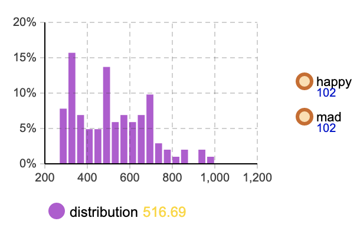 3_RS_C</td>
  </tr>
</table>

#### C) 

The robot's main issue is that they aren't as nimble as human servers. However, if alotted their own lanes, they could more than make up for this with high speeds. They could also be designed to be smaller than human servers, and thus not get in the way as much. However, as they are modeled now, they can only help the servers, by providing additional support, and cannot replace them.

---

*please note that while an effort was made to maximize simulation time, such that seconds=minutes and minutes=hours, certain internal dynamics (such as pedestrian movement speed) do not allow for a complete 60x simulation time to real time. This means that the time scale is somewhat arbitrary.

